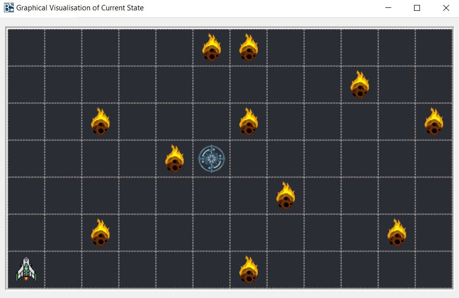

# Spaceship & Asteroids Arcade Game - B Specification

Project is based on B Specification for Spaceship & Asteroids game. 

## Scenario
The Spaceship can traverse in a grid space of 12x7 and some specific locations of the space are populated with asteroids. User is given the Starbase position which is the Spaceship's destination where the spaceship should be docked.<br/>
Initially Spaceship is in Homebase(1,1) with 100 units of power and each movement costs power and user should get the Spaceship to the Starbase before the power runs out to win the game.

Each movement and asteroid crash reduces Spaceship's power, <br/>
Nomral Movement -> 5 units of power <br/>
Warp Jump -> 20 units of power <br/>
Crash into Asteroid -> 10 units of power <br/>

### States
* Spaceship is docked at the Starbase -> Game Won
* Spaceship is not docked at the Starbase & No power for movement -> Game Lost
* Otherwise -> Game Not Over

## Overview
Machine was implemented with operations for the movement of the spaceship, warp jump, New Game/Reset Game, Mission Status, Visited Regions, Docked at Starbase and Game Status. 


## Graphical View



## Used Tools

* Atelier B
* ProB

## Configurations

ProB tool configurations

```
Preferences -> Configurations -> MININT..MAXINT (32bit)
```

```
Preferences -> Animation preferences -> MAX_OPERATIONS  (Set MAX_OPERATIONS > 100)
```

## Author
Athindu Umayanga : [@Athindu](https://github.com/Athindu)


###
<br/>
The project was developed to complete the coursework in Reasoning about Programs module at University of Westminster.
